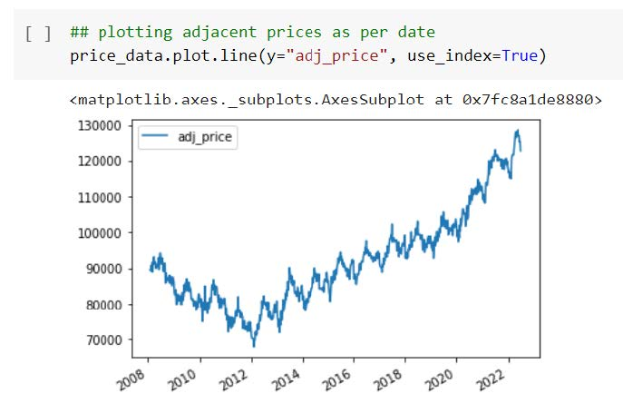
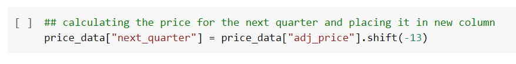
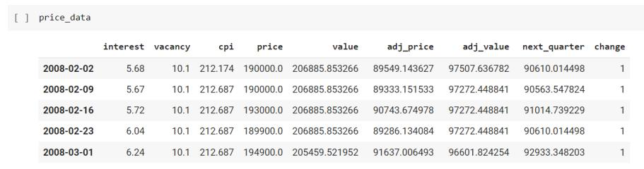

# House Price Prediction
This repo is a submission for 255 Data Mining Final Project.

## 1. Boston House Price Prediction
In this project, we explored on predicting the house prices in Boston, using the load_boston dataset from the sklearn datasets.

Colab Link
https://colab.research.google.com/drive/1UEDWClpUkHbVGyZbdVxC4KRLgf2gYNEq?usp=sharing

### Architecture
The picture below is the architecture diagram for this task.

This task is divided into multiple steps. They are:
• Loading the Boston Dataset
• Performing Exploratory Data Analysis
• Algorithms Used
• Training the Model
• Saving the Model
• Flask web application
• Deployment

### Loading the Boston Dataset
Load the dataset from the sklearn datasets using load_boston( ).

### Performing Exploratory Data Analysis (EDA)
Performed all the plotting, and ran some basic commands to view the data.

Algorithms used: We have used 5 algorithms. They are:
• Linear Regression
• Decision Tree
• Random Forest
• XGBoost
• SVM (Support Vector Machines)

#### Training the Model
First split the data into train and test. The snippet below shows the creation of a model, for instance, Random Forest. The model prediction has been done on the train data. The model evaluation has been done using R-square, mean absolute error, mean square error, and Root mean square error. 

R-Square (𝑅^2): It is a measure of the linear relationship between X and Y. It is interpreted as the proportion of the variance in the dependent variable that is predictable from the independent variable. 

Adjusted R-Square (𝑅^2): The adjusted R-squared compares the explanatory power of regression models that contain different numbers of predictors. 

Mean Absolute Error (MAE): It is the mean of the absolute value of the errors. It measures the difference between two continuous variables, here actual and predicted values of y.

Mean Square Error (MSE): The mean square error (MSE) is just like the MAE, but squares the difference before summing them all instead of using the absolute value. 

Root Mean Square Error (RMSE): The root mean square error (RMSE) is just the square root of the mean square error.

#### Comparison of the models
The snippet attached below lists the RMSE values obtained for all the 5 models.
For selecting the best model among the list, the parameter used is RMSE, since the lower the RMSE, the better a model can perform. Hence, from the below snippet, Random Forest is the best model for this dataset.

### Saving the Model
The snippet below shows how a model is saved into a pickle file.

### Flask web application
Here, first load the pickle file that you saved in the above step. We have listed routes for the input data to populate and the response that has to come. This is just a single page where all the inputs are shown and a user can enter the values according to their requirement. Based on the values given, the price of the house is predicted.

### Results
Attaching all the snippets of the house price prediction value obtained for every algorithm used. The input provided is the 3rd row from the snippet below and the estimated price is 34.7

Now, let’s see if the predicted value from the Random forest is close to 34.7 when compared with other models.

Linear Regression: The predicted value for the linear regression is 30.94

SVM: The predicted value for the SVM is 30.29

Decision Tree: The predicted value is 33.1

Random Forest: The predicted value is: 34.35

### How to run this code
• You can first run the colab notebook and understand all the steps. Here, you will have to download all the pickle files at the end and save them in respective folders.

• Let’s say, you want to directly predict the house prices, you can just clone the repo, go to a particular folder (based on whichever model you want to work with), and run “python app.py”.

• http://127.0.0.1:5000/ you can see your web page here.

### Conclusion
Boston Housing dataset is a good example for understanding the concepts like loading the dataset, performing exploratory data analysis, how to create, training a model, how to create a FLASK application, how we can feed a model into a FLASK application, how we predict the prices. It is a complete end-to-end project which helped us in obtained good knowledge.

Using these price prediction datasets, a user can predict the price of a house and make decisions depending on that, which is easy for a user.

### References
• https://www.kaggle.com/code/shreayan98c/boston-house-price-prediction#Random-Forest-Regressor
• https://www.geeksforgeeks.org/flask-creating-first-simple-application/#:~:text=Flask%20is%20a%20web%20application,to%20set%20up%20your%20environment

## 2. California Housing Prices
In this exercise, I used a dataset from Kaggle.

Dataset: Housing.csv (Attaching this in the folder)

Colab Link:
https://colab.research.google.com/drive/1aN_lm8wGU8WVFe9_gHqbwfNPY_0kmsEV?usp=sharing

### Aim 
Unlike the Boston Housing Dataset, which was easy because, the data was neatly organized. So, we wanted to gain some experience around working with datasets we have to perform some exploratory data analysis, update the data according to the requirement.

### Steps Carried Out
• Loading the Dataset
• Performing Exploratory Data Analysis (EDA)
• Training the Model

Loading the Dataset: As this dataset is a .csv file, to get that data, we need to use a pandas function read_csv and then load the dataset.

Performing EDA: First, when we print the dataset, it looked like this.

Here, if you take a look at the columns: mainroad, guestroom, basement, hotwaterheating, airconditioning, perfarea and furnishingstatus. They are given as a string.

I want to change them to integers. So, I changed them as shown below and now take a look at the dataset after performing changes.

Using some basic commands, retrieved some more information about the dataset and plotted some graphs, to better understand, how is the price changing with respect to either guestrooms/bedrooms/bathrooms.

You can take a look at all of this information from the above attached colab link.

Now, with the dataset that we have, we did data splitting first and then we used 3 models to train this dataset.

Algorithms used:
• Linear Regression
• Decision Tree Regression
• Forest Tree Regression

Using these algorithms, we created and trained a model, and retrieved some metrics.

To obtain the best model, calculate the RMSE for all the models.

Out of all the models, linear regression is the best model as it has a low RMSE.

### Conclusion
This has been done to mention that Exploratory Data Analysis is a crucial part in the data mining. Once you understand how you want your data to be plotted/organized. It becomes really easy to work on, as you eliminate all of the unnecessary data.

## 3. Redfin Marketing Data
This exercise is to play with latest and huge amounts of data obtained from the Redfin official website.

### Aim
This activity is performed to analyze when is the good time to buy or sell a house and observing the factors affecting the prices. Redfin provides consolidated nationwide to zip code level housing market data and is used to effectively visualize the information using this dataset. The housing market report will leverage selling price, sold homes, listings, market days, and price drops present in the redfin dataset. The data is computed over a 12-week period and updated once a week.

### Steps Carried Out
Imported required libraries to access the redfin data and displaying it.

We can directly download by passing this URL 

url = 'https://redfin-public-data.s3.us-west-2.amazonaws.com/redfin_market_tracker/zip_code_market_tracker.tsv000.gz'

But there was an error saying, the data is very huge and a powerful machine is required to obtain that data. Hence, manually, downloaded the dataset from that website and uploaded it to google drive and accessed it from there.

If you take a look at the output here, there are about 6M rows in this dataset. That is huge.

### Significance of each column in the dataset
median_sale_price: The final home sale price covering all homes with a sale date during a given time period where 50% of the sales were above this price and 50% were below this price.

median_list_price: The most recent listing price covering all homes with a listing date during a given time period where 50% of the active listings were above this price and 50% were below this price.

median_ppsf: The median list price per square foot of all active listings.

homes_sold: Total number of homes with a sale date during a given time period.

pending_sales: Total homes that went under contract during the period. Excludes homes that were on the market longer than 90 days.

new_listings: Total number of homes with a listing added date during a given time period.

inventory: Total number of active listings on the last day a given time period.

months_of_supply: When data are monthly, it is inventory divided by home sales. This tells you how long it would take supply to be bought up if no new homes came on the market.

median_dom: The number of days between the date the home was listed for sale and when the home went off-market/pending sale covering all homes with an off-market date during a given time period where 50% of the off-market homes sat longer on the market and 50% went off the market faster. Excludes homes that sat on the market for more than 1 year.

avg_sale_to_list: The mean ratio of each homes sale price divided by their list price covering all homes with a sale date during a given time period. Excludes properties with a sale price 50%.

sold_above_list: The percent of homes sales with a sale price greater than their latest list price covering all homes with a sale date during a given time period. Excludes properties with a sale price 50% above the listing price or with a sale price 50% below the list price.

price_drops: How many listings dropped their price in a given time period.

off_market_in_two_weeks: The total number of homes that went under contract within two weeks of their listing date.

Filtering only Florida data for analysis purposes and later will be expanded to the entire dataset.

Pulling in the geography dataset to map the location and data

Filtering geography dataset to include only 5 counties in Florida

Cleaning the dataset to remove the invalid zip codes

Filtering the dataset to single zip code and property type

Recalculating median_dom_mom

Downloading the dataset to visualize it in tableau dashboard

The output of this colab notebook is a new csv file, which we will be using further for visualizations in the tableau dashboard, here the data is specific to florida and as shown in the above steps.

### Visualizations
Dashboard link: https://10az.online.tableau.com/t/255finalproject/authoring/255_final_project/Dashboard2#2

First, create an account on tableau. We have used this platform for visualizing the data from the above downloaded csv file. You can customize as per your requirement. It is easy to assemble and It gives a good idea on the performance of the metrics. The main motto was, making these metrics available to a user will give much better idea/understanding for a user. We consider it is an important parameter i.e., having/looking at more information, gives a better picture. A user will get clarity on whether to go ahead or not and can make better choices.

Attaching the snippet of how the overall dashboard looks like:

Here, the main advantage is, a user has various options to choose. On the right side, there are filters as you can see. It is user’s choice to select what they want and the data will be displayed according to the filters applied.

This Dataset has been used effectively in a tableau dashboard and can cater to the user's needs by providing the required information in visualized format. The user can filter data according to the city, property type, county, zipcode, time period.

Median DOM is the number of days between the date the home was listed for sale and when the home went off-market/pending sale covering all homes with an off-market date during a given time period where 50% of the off-market homes sat longer on the market and 50% went off the market faster. Excludes homes that sat on the market for more than 1 year.

The user can use this information to assess the buffer period to make his decision from the time the property is listed for sale.

This graph shows the total number of active listings on the last day of a given time period for each property listing.

The left graph median_list_price is the most recent listing price covering all homes with a listing date during a given time period where 50% of the active listings were above this price and 50% were below this price and the right part of the graph median_ppsf is the median list price per square foot of all active listings.

Through these graphs the buyer can estimate if there will be further listing of houses and if so will the house prices increase or decrease.

Colab Link:
https://colab.research.google.com/drive/1kVOI3qajzpY2JcZOmwkh2998prI6VYj6?usp=sharing

### Conclusion
Working with such huge data gives more insights and tableau dashboard has helped in plotting the data very smoothly. This process has been experimented on zipcode data, but there is data available with other parameters. Tableau is a really good platform for visualizations, as a user has various options to choose from and can plot as we wish.

### References
• https://www.redfin.com/news/data-center/
• https://levelup.gitconnected.com/how-to-get-data-on-the-housing-market-using-python-603317f9291a

### Future Scope
To integrate the dashboard with the website. Hence, it will be available for the user to obtain information according to their needs.

## 4. US Federal Data + Zillow Data
This exercise is to predict the price of a house for the next quarter and observe if the price is increasing or decreasing.

Colab link:
https://colab.research.google.com/drive/1AnM4drGopGQs9B8GIV0yQ0ZgAzlIMaYC?usp=sharing

### Aim
The main aim of this task is to make use of 2 different datasets. Create a new dataset by merging both of the input datasets. Predict the price of a house for the next quarter and observe if the price is a rise or a fall.

### Steps Carried Out
The four main steps performed are:
• Loading the Datasets
• Performing Exploratory Data Analysis
• Forecasting the prices for next quarter
• Evaluation

### Loading the Datasets
Here, we have made use of 2 datasets. One is US Federal Data and the other is from Zillow. The snippet below shows what are the required files and what is the content of that file.

All of the data associated such as inflation, mortgage, and, rental vacancy rate are present in separate files. So, we have to observe all of that data and make sure that we do data cleaning and create a new dataset which has all of this data, neatly organized and labeled properly.

### Performing EDA
Having loading the necessary files, first we have to look at the data by printing them. The first 3 files, that is, inflation, vacancy rate and mortgage have to be merged. Once, you have all these 3 columns in a single data frame, then look for null values and remove all of them.

From the Zillow datasets, one is median sales price in US for each week and the other one is average price of the house obtained monthly. Print both these datasets and observe the data. From
20 both the datasets, we have first 5 columns as common and then the others differ, as the first one is the week data and the other is the month wise. So, we will have to create the index first which is going to be weeks, this is the formatting that we need to do. Hereafter, merge both the datasets by keeping the index as the date and thereafter delete the unnecessary columns. Here, we get a data frame which will have date as the index and the columns are price and value.

Now, it’s time to merge the US federal data and the Zillow data. Here, if you observe the dates are not aligning (that means they are not same, to merge directly). Hence, we need to do some adjusting, which is done as shown below:

Now, that we have the index ready. Merge both the datasets. So, now you will have date as the index and 5 columns (3 are from federal data and 2 are from Zillow data). This is the main aim of exploratory data analysis. We removed all of the unnecessary data and create a new data frame as we needed it. This task can be considered as one good example for learning EDA.
Now, rename the columns as shown below:

Calculated the adjacent prices and values as shown below and plotted some graphs as attached below:

### Forecasting the prices for next quarter
Calculate the price for the next quarter as shown below and create a new column to put that data. This is basically done by observing the data that we have already. Here, as we have date as the index, by observing the adjacent price and the value of next quarter is obtained by shifting to the 13th row. It is even more easy to look at the data frame for better understanding.

Remove all the null values, if there are any.
Now, compare the current price and the price for the next quarter. If the value for next quarter is high, which means a rise, then create a new column named ‘change’ and keep the rise as ‘1’ and fall as ‘0’.

Now, the data frame looks as shown below:

### Evaluation
Here, as predictors, we chose 4 columns, that is interest, adjacent price, adjacent value, vacancy and the target is the “change” column that you have created above. Creating a Random Forest model. The accuracy obtained after training the model with the above predictors is 59.52 %. Here, to improve the accuracy, we have a function called Backtesting. This creates new predictors based on the previous values and the accuracy with these new predictors is 65.3%. Finally, a plot showing the actual and predicted values:

### Conclusion
Arranging the required information and predicting the value for the next quarter is useful for a user to see if the house is going to be appreciated or depreciated. This is one useful exercise.

### References
• https://www.zillow.com/research/data/
• https://fred.stlouisfed.org/series/CPIAUCSL
• https://fred.stlouisfed.org/series/RRVRUSQ156N
• https://fred.stlouisfed.org/series/MORTGAGE30US