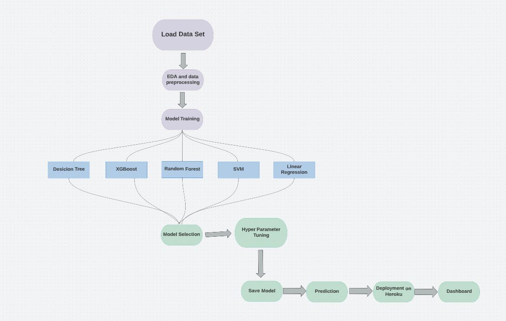

# House Price Prediction
This repo is a submission for 255 Data Mining Final Project.

## 1. Boston House Price Prediction
In this project, we explored on predicting the house prices in Boston, using the load_boston dataset from the sklearn datasets.

Colab Link
https://colab.research.google.com/drive/1UEDWClpUkHbVGyZbdVxC4KRLgf2gYNEq?usp=sharing

### Architecture
The picture below is the architecture diagram for this task.

This task is divided into multiple steps. They are:
• Loading the Boston Dataset
• Performing Exploratory Data Analysis
• Algorithms Used
• Training the Model
• Saving the Model
• Flask web application
• Deployment

### Loading the Boston Dataset
Load the dataset from the sklearn datasets using load_boston( ).

### Performing Exploratory Data Analysis (EDA)
Performed all the plotting, and ran some basic commands to view the data.

Algorithms used: We have used 5 algorithms. They are:
• Linear Regression
• Decision Tree
• Random Forest
• XGBoost
• SVM (Support Vector Machines)

#### Training the Model
First split the data into train and test. The snippet below shows the creation of a model, for instance, Random Forest. The model prediction has been done on the train data. The model evaluation has been done using R-square, mean absolute error, mean square error, and Root mean square error. 

R-Square (𝑅^2): It is a measure of the linear relationship between X and Y. It is interpreted as the proportion of the variance in the dependent variable that is predictable from the independent variable. 

Adjusted R-Square (𝑅^2): The adjusted R-squared compares the explanatory power of regression models that contain different numbers of predictors. 

Mean Absolute Error (MAE): It is the mean of the absolute value of the errors. It measures the difference between two continuous variables, here actual and predicted values of y.

Mean Square Error (MSE): The mean square error (MSE) is just like the MAE, but squares the difference before summing them all instead of using the absolute value. 

Root Mean Square Error (RMSE): The root mean square error (RMSE) is just the square root of the mean square error.

#### Comparison of the models
The snippet attached below lists the RMSE values obtained for all the 5 models.
For selecting the best model among the list, the parameter used is RMSE, since the lower the RMSE, the better a model can perform. Hence, from the below snippet, Random Forest is the best model for this dataset.

### Saving the Model
The snippet below shows how a model is saved into a pickle file.

### Flask web application
Here, first load the pickle file that you saved in the above step. We have listed routes for the input data to populate and the response that has to come. This is just a single page where all the inputs are shown and a user can enter the values according to their requirement. Based on the values given, the price of the house is predicted.

### Results
Attaching all the snippets of the house price prediction value obtained for every algorithm used. The input provided is the 3rd row from the snippet below and the estimated price is 34.7

Now, let’s see if the predicted value from the Random forest is close to 34.7 when compared with other models.

Linear Regression: The predicted value for the linear regression is 30.94

SVM: The predicted value for the SVM is 30.29

Decision Tree: The predicted value is 33.1

Random Forest: The predicted value is: 34.35

### How to run this code
• You can first run the colab notebook and understand all the steps. Here, you will have to download all the pickle files at the end and save them in respective folders.

• Let’s say, you want to directly predict the house prices, you can just clone the repo, go to a particular folder (based on whichever model you want to work with), and run “python app.py”.

• http://127.0.0.1:5000/ you can see your web page here.

### Conclusion
Boston Housing dataset is a good example for understanding the concepts like loading the dataset, performing exploratory data analysis, how to create, training a model, how to create a FLASK application, how we can feed a model into a FLASK application, how we predict the prices. It is a complete end-to-end project which helped us in obtained good knowledge.

Using these price prediction datasets, a user can predict the price of a house and make decisions depending on that, which is easy for a user.

### References
• https://www.kaggle.com/code/shreayan98c/boston-house-price-prediction#Random-Forest-Regressor
• https://www.geeksforgeeks.org/flask-creating-first-simple-application/#:~:text=Flask%20is%20a%20web%20application,to%20set%20up%20your%20environment

